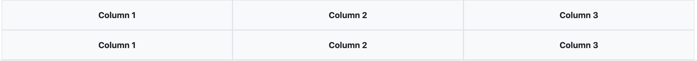
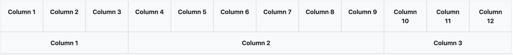
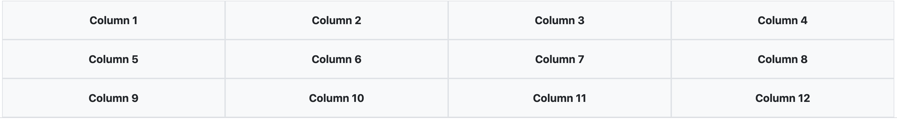
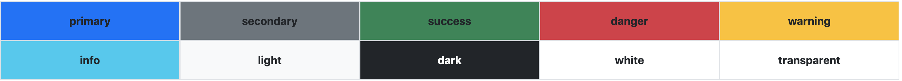
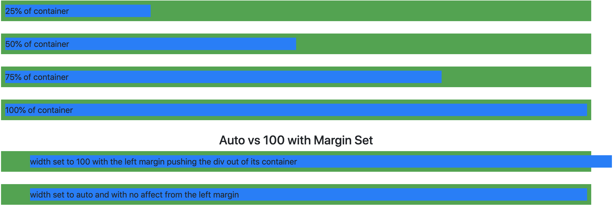
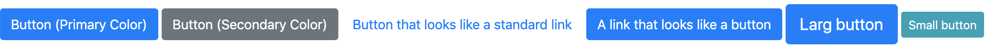

# CSS Frameworks: Bootstrap Fundamentals
CSS Frameworks, like other frameworks, help developers speed up their development time by helping them avoid reinventing the wheel every time they need to add standard features to their application. CSS frameworks have already decided what buttons should look like, how to implement a mobile-first design, how to implement a Navigation bar, or even a slideshow. We still have the flexibility to override the styles the frameworks provide because of the nature of CSS. This allows developers to write much less CSS than if we were starting from scratch with a blank document.

In this lesson, we will focus on the [Bootstrap](http://www.getbootstrap.com) framework which was originally created at Twitter in 2010, Bootstrap has become one of the most popular front-end frameworks and open-source projects in the world. This lesson will focus on Bootstrap 4.6.X. Bootstrap 5 is in beta at the time of writing this lesson. The high-level concepts are the same as previous versions and this will be the last beta before the final release.


> To read more about the history of Bootstrap, [click here](https://getbootstrap.com/docs/5.0/about/overview/).
  To read more about the final beta release of Bootstrap 5, [click here](https://blog.getbootstrap.com/2021/03/23/bootstrap-5-beta-3/)

## Including Bootstrap in your Project
In order to use Bootstrap, we have to include it in our project. There are several ways to accomplish this depending on how your project is set up. **We will focus on the 2 easiest and most common ways to include Bootstrap into your project to help you get started.**

> **Several components rely on JavaScript to function properly. jQuery and Popper are imported as well as the Bootstrap CSS to provide additional functionality for the following components:**
>  - **Alerts** for dismissing
>  - **Buttons** for toggling states and checkbox/radio functionality
>  - **Carousel**or all slide behaviors, controls, and indicators
>  - **Collapse** for toggling visibility of content
>  - **Dropdowns** for displaying and positioning (requires Popper)
>  - **Modals** for displaying, positioning, and scrolling behavior
>  - **Navbar** for extending our Collapse plugin to implement responsive behavior
>  - **Tooltips** and popovers for displaying and positioning (requires Popper)
>  - **Scrollspy** for scroll behavior and navigation updates

----

### Using the jsDelivr CDN (Content Delivery Network)
As a developer, the quickest way to start using Bootstrap is by including the `CSS` and `JS` files into your project using the jsDelivr CDN (content delivery network). Bootstrap provides detailed instructions on how to include Bootstrap using the CDN in their [quick start instructions](https://getbootstrap.com/docs/5.0/getting-started/introduction/#quick-start)

**Your HTML file will look like the following example when including Bootstrap from the CDN**  

```HTML
<!doctype html>
<html lang="en">
  <head>
    <!-- Required meta tags -->
    <meta charset="utf-8">
    <meta name="viewport" content="width=device-width, initial-scale=1">

    <!-- Bootstrap CSS Included Here -->
    <link rel="stylesheet" href="https://cdn.jsdelivr.net/npm/bootstrap@4.6.0/dist/css/bootstrap.min.css" integrity="sha384-B0vP5xmATw1+K9KRQjQERJvTumQW0nPEzvF6L/Z6nronJ3oUOFUFpCjEUQouq2+l" crossorigin="anonymous">

    <title>Hello, world!</title>
  </head>
  <body>
    <h1>Hello, world!</h1>

    <!-- jQuery and Bootstrap Bundle included here (includes Popper) -->
    <script src="https://code.jquery.com/jquery-3.5.1.slim.min.js" integrity="sha384-DfXdz2htPH0lsSSs5nCTpuj/zy4C+OGpamoFVy38MVBnE+IbbVYUew+OrCXaRkfj" crossorigin="anonymous"></script>
    <script src="https://cdn.jsdelivr.net/npm/bootstrap@4.6.0/dist/js/bootstrap.bundle.min.js" integrity="sha384-Piv4xVNRyMGpqkS2by6br4gNJ7DXjqk09RmUpJ8jgGtD7zP9yug3goQfGII0yAns" crossorigin="anonymous"></script>

  </body>
</html>
```

> In Bootstrap 5, jQuery is no longer a dependency and has been removed.

----


### Downloading Bootstrap (NOT RECOMMENDED FOR THIS LESSON)
As a developer, you can download ready-to-use compiled code for Bootstrap and easily drop it into your project. This method will ensure that Bootstrap is always available to your project as we are not relying on jsDelivr, a free open-source CDN Bootstrap uses, to be up and available to ensure we have access to the Bootstrap resources that our site relies on.

**To download Bootstrap for your project follow these steps:**  

1. Visit https://getbootstrap.com/docs/4.6/getting-started/download/#compiled-css-and-js and click `Download` to start downloading the Bootstrap Zip File that contains the `JS` and `CSS` folders/files that you would include in your site.

    > The Zip file downloaded will contain several versions of the CSS and JavaScript files. To better understand the differences between the files included, visit [this page](https://getbootstrap.com/docs/4.6/getting-started/contents/#css-files).

2. Unzip the downloaded file and move the `JS` and `CSS` files/folders to your projects directory where you are storing files of a similar type. The idea is to keep your JavaScript files together and Your CSS files together.

3. Link the Bootstrap CSS and JS files to my HTML files. 

4. For now, we will continue to use the CDN for jQuery but you could visit https://jquery.com/download/ to download a local copy of the slim build to include locally.

    **Assuming we put the `JS` and `CSS` folders in the root directory of the project, this is what the page would look like if we link both the CSS and JS files in our HTML page**

```HTML
    <!doctype html>
    <html lang="en">
    <head>
        <!-- Required meta tags -->
        <meta charset="utf-8">
        <meta name="viewport" content="width=device-width, initial-scale=1">

        <!-- Bootstrap CSS Included Here -->
        <link href="./CSS/bootstrap.min.css" rel="stylesheet">

        <title>Hello, world!</title>
    </head>
    <body>
        <h1>Hello, world!</h1>

        <!-- include jQuery slim (excludes the ajax and effects) -->
        <script src="https://code.jquery.com/jquery-3.5.1.slim.min.js" integrity="sha384-DfXdz2htPH0lsSSs5nCTpuj/zy4C+OGpamoFVy38MVBnE+IbbVYUew+OrCXaRkfj" crossorigin="anonymous"></script>
        <!-- Include the Bootstrap JavaScript Bundle File here -->
        <script src="./JS/bootstrap.bundle.min.js"></script>
    </body>
    </html>
```

> In Bootstrap 5, jQuery is no longer a dependency and has been removed.

## Mobile First Design
Bootstrap focuses on mobile-first responsive design. Most components are completely responsive with very little effort and bootstrap provides several classes that align with breakpoints to help us control how our layouts respond to changes in the viewport size.

**Breakpoints**
Bootstrap uses media queries intended to create sensible breakpoints ranging from `xs` - `xl` we can apply to our layout allowing our content to be responsive to viewport changes.

- `xs` (Portrait Phones)  - **Active when the viewport is >= 0**
- `sm` (Landscape Phones) - **Active when the viewport width is >= 576px**
- `md` (Tablets) - **Active when the viewport width is >= 768px**
- `lg` (Desktops) - **Active when the viewport width is >= 992px**
- `xl` (Large Desktops) - **Active when the viewport width is >= 1200px**

> You will rely on breakpoints to control the behavior of **Containers** and the **Grid System** to ensure that your content looks good no matter what screen size it is present on.

## Bootstrap Containers
Containers are layout elements in Bootstrap. Containers are used to group together elements as well as provide some default padding and margin. Containers are responsive to screen size as well

**The two commonly used container classes provided by Bootstrap are `.container` and `.container-fluid`**

```HTML
  <!-- The most common containers (.container and .container-fluid) -->
  <div class="container">100% wide until small breakpoint (<576px)</div>
  <div class="container-fluid">Always 100% wide</div>

  <!-- Responsive containers that are 100% wide until a certain breakpoint -->
  <div class="container-sm">100% wide until small breakpoint (<576)</div>
  <div class="container-md">100% wide until medium breakpoint (>= 768px)</div>
  <div class="container-lg">100% wide until large breakpoint (>= 992px)</div>
  <div class="container-xl">100% wide until extra-large breakpoint (>= 1200px)</div>
```

> **For a deeper dive into containers, check out [https://getbootstrap.com/docs/4.6/layout/overview/#containers](https://getbootstrap.com/docs/4.6/layout/overview/#containers)**

## The Bootstrap Grid
The Bootstrap grid system allows us to create a table-like structure of rows and columns to create responsive layouts for our pages.  Unlike traditional tables, making the Bootstrap grid respond to changes in the viewport size is really easy. This allows us to make elements appear next to each other when viewing our site on a desktop and stack on top of each other when viewing our site on a mobile device.

**How The Grid Works**  
- The grid should be wrapped in a `container`
- We are allowed 12 columns in the grid
- Columns should be wrapped in rows
- Each column has horizontal padding (called a gutter)
- In a grid layout, content must be placed within columns and only columns may be immediate children of rows.
- You can use special column classes like `.col-4` to control how many columns out of the 12 a specific column should span.
- We can use breakpoint classes to make our grid responsive

----

### Creating a Simple Grid
When creating a grid we must start with a container. The container will be the parent element for our responsive grid and help control how much of the viewport the grid takes up. Once we have a container, we can start adding rows and columns.

**This is a simple grid example with 2 rows each containing 3 columns**  
```HTML
  <div class="container">
    <div class="row">
      <div class="col"> Column 1 </div>
      <div class="col"> Column 2 </div>
      <div class="col"> Column 3 </div>
    </div>
    <div class="row">
      <div class="col"> Column 1 </div>
      <div class="col"> Column 2 </div>
      <div class="col"> Column 3 </div>
    </div>
  </div>
```

**This would produce a grid similar to the following**  


----

### Using Column Classes
Column classes allow us to control how many columns out of the 12 allowed a particular column can span

**This is a simple grid example with 2 rows. The first row has 12 equally spaced columns. The second row uses column classes to make the center column span 6 columns out of the 12**  
```HTML
  <div class="container">
    <div class="row">
      <div class="col"> Column 1 </div>
      <div class="col"> Column 2 </div>
      <div class="col"> Column 3 </div>
      <div class="col"> Column 4 </div>
      <div class="col"> Column 5 </div>
      <div class="col"> Column 6 </div>
      <div class="col"> Column 7 </div>
      <div class="col"> Column 8 </div>
      <div class="col"> Column 9 </div>
      <div class="col"> Column 10 </div>
      <div class="col"> Column 11 </div>
      <div class="col"> Column 12 </div>
    </div>
    <div class="row">
      <div class="col"> Column 1 </div>
      <div class="col-6"> Column 2 </div>
      <div class="col"> Column 3 </div>
    </div>
  </div>
```

**This would produce a grid similar to the following**  


> **Responsive column classes like `.col-md-6` are also availble. When applied, we can control how our columns appear based on breakpoints. Maybe we want our columns stacked on mobile or our columns to be different a different width on mobile vs desktop. To learn more, visit [https://getbootstrap.com/docs/4.6/layout/grid/#responsive-classes](https://getbootstrap.com/docs/4.6/layout/grid/#responsive-classes)**

----

### Using Row Column Classes
Column classes allow us to control how many columns out of the 12 allowed a particular column can span

**This is a simple grid example with 1 row containing 12 columns. Using `row-col-4` we will get 3 rows containing 4 columns**  
```HTML
  <div class="container">
    <div class="row row-cols-4">
      <div class="col"> Column 1 </div>
      <div class="col"> Column 2 </div>
      <div class="col"> Column 3 </div>
      <div class="col"> Column 4 </div>
      <div class="col"> Column 5 </div>
      <div class="col"> Column 6 </div>
      <div class="col"> Column 7 </div>
      <div class="col"> Column 8 </div>
      <div class="col"> Column 9 </div>
      <div class="col"> Column 10 </div>
      <div class="col"> Column 11 </div>
      <div class="col"> Column 12 </div>
    </div>
  </div>
```

**This would produce a grid similar to the following**  


> **There are also responsive row column classes like `.row-cols-md-4` that let you change the number of columns that would appear in a row based on breakpoints. To learn more, visit [https://getbootstrap.com/docs/4.6/layout/grid/#row-columns](https://getbootstrap.com/docs/4.6/layout/grid/#row-columns)**


## Bootstrap Utility Classes
Bootstrap provides several categories of utility classes that can help us format our content. **Utility class can help us with adding adding borders to our elements, changing the colors of elements on our pages, controlling spacing through margin and padding, and even things like positioning our elements where we want them without having to write our own custom CSS.** 

> **In this section, we will cover some of the most common utility classes provided. For a complete list of Bootstrap utility classes, visit: [https://getbootstrap.com/docs/4.6/utilities](https://getbootstrap.com/docs/4.6/utilities)**

----

### Color Utility Classes
We can use the color utility classes to change the color of various elements on our pages. The color utility classes give us control over things like border color, text color, background color, and even some built-in Bootstrap Components leverage the color classes to change how they appear to our users.

**Colors and the names of their classes available to us through bootstrap**


**Examples of the color utilities being used for backgrounds and text**

```HTML

<!-- Examples of the text color utility classes being used to change the color of the text in a paragraph element -->
<p class="text-primary">.text-primary</p>
<p class="text-secondary">.text-secondary</p>
<p class="text-success">.text-success</p>
<p class="text-danger">.text-danger</p>
<p class="text-warning">.text-warning</p>
<p class="text-info">.text-info</p>

<!-- Examples of the background color utility classes being used to change the background color of a div element -->
<div class="bg-primary">.bg-primary</div>
<div class="bg-secondary">.bg-secondary</div>
<div class="bg-success">.bg-success</div>
<div class="bg-danger">.bg-danger</div>
<div class="bg-warning ">.bg-warning</div>
<div class="bg-info">.bg-info</div>
<div class="bg-light">.bg-light</div>
<!-- text-white added as well so the text is visible in the div -->
<div class="bg-dark text-white">.bg-dark</div>
<div class="bg-white">.bg-white</div>
<div class="bg-transparent">.bg-transparent</div>

```

> **For more information on the Bootstrap color utility classes, visit: [https://getbootstrap.com/docs/4.6/utilities/colors/](https://getbootstrap.com/docs/4.6/utilities/colors/)**

----

### Border Utility Classes
We can use the border utility classes to add or remove an element’s borders. Below is the behavior of the base border utilities provided by Bootstrap.

- `border` - Adds a 1px border to all sides of an element
- `border-top` - Adds a 1px border to the top of an element
- `border-right` - Adds a 1px border to the right side of an element
- `border-bottom` - Adds a 1px border to the bottom of an element
- `border-left` - Adds a 1px border to left side of an element

**Examples of the border utilities in action**  

```HTML
<!-- default use of border utility classes -->
<span class="border">Border on all sides</span>
<span class="border-top">Top border only</span>
<span class="border-right">Right border only</span>
<span class="border-bottom">Bottom border only</span>
<span class="border-left">Left border only</span>

<!-- combining border classes -->
<span class="border-left border-right">Left and Right border</span>

<!-- colored borders border classes using border-primary -->
<span class="border-left border-right border-primary">Left and Right border</span>
```

> **For more information on the Bootstrap border utility classes, visit: [https://getbootstrap.com/docs/4.6/utilities/borders/](https://getbootstrap.com/docs/4.6/utilities/borders/)**

----

### Sizing Utility Classes
The sizing utility classes control the width and height of elements on your page. Sizing utility classes support `25%`, `50%`, `75%`, `100%`, and `auto` by default.

**Width utility classes**  

- `w-25` - 25% of the parent containers available horizontal space
- `w-50` - 50% of the parent containers available horizontal space
- `w-75` - 75% of the parent containers available horizontal space
- `w-100` - 100% of the parent containers available horizontal space (can be affected by additional margin and appear to extend past its container) 
- `w-auto` - default behavior of a block-level element taking up all the available horizontal space in its container but not affected by an additional margin

**Height utility classes**  

- `h-25` - 25% of the parent containers available vertical space
- `h-50` - 50% of the parent containers available vertical space
- `h-75` - 75% of the parent containers available vertical space
- `h-100` - 100% of the parent containers available vertical space (can be affected by additional margin and appear to extend past its container) 
- `h-auto` - default behavior of a block-level element taking up all the available vertical space in its container but not affected by an additional margin

**A visual representation of the `width` sizing classes highlighting `auto` vs `100`**




> **For more information on the Bootstrap sizing utility classes, visit: [https://getbootstrap.com/docs/4.6/utilities/sizing/](https://getbootstrap.com/docs/4.6/utilities/sizing/)**

----

### Spacing Utility Classes
The spacing utility classes control the padding and margin for elements on your page. `p` is used for padding and `m` is used for margin but can be modified with what bootstrap refers to as **sides** and **size**.

**Base padding utility classes and sides**  

> These must be combined with a size

- `p`  - Padding for all 4 sides of an element
- `pt` - Padding for the top of an element
- `pr` - Padding for the right side of an element
- `pb` - Padding for the bottom of an element
- `pl` - Padding for the left side of an element
- `px` - Padding for the left and right sides of an element
- `py` - Padding for the top and bottom of an element

> In Bootstrap 5 `l` and `r` representing the **left** and **right** padding have been replaced to reflect the flexbox vocabulary of **start** and **end**. `pl` becomes `ps` and `pr` becomes `pe`

**Base margin utility classes and sides**  

> These must be combined with a size

- `m ` - Margin for all 4 sides of an element
- `mt` - Margin for the top of an element
- `mr` - Margin for the right side of an element
- `mb` - Margin for the bottom of an element
- `ml` - Margin for the left side of an element
- `mx` - Margin for the left and right sides of an element
- `my` - Margin for the top and bottom of an element

> In Bootstrap 5  `l` and `r` representing the **left** and **right** margins have been replaced to reflect the flexbox vocabulary of **start** and **end**. `ml` becomes `ms` and `mr` becomes `me`

**Sizing options for the above spacing utility classes** 

**$spacer** is equal to `1rem` by defualt

- `0` - Eliminates the margin or padding by setting it to 0
- `1` - Sets the margin or padding to $spacer * .25
- `2` - Sets the margin or padding to $spacer * .5
- `3` - Sets the margin or padding to $spacer
- `4` - Sets the margin or padding to $spacer * 1.5
- `5` - Sets the margin or padding to $spacer * 3
- `auto` - Sets the margin to auto which can help center elements within their container or maximize the specified margin or padding set for a particular side

**Examples of the spacing utilities in action** 

```HTML

<!-- examples of padding utility classes combined with borders to help visualize the differences -->
<span class="p-5 border">set the padding to 5 (1rem * 3) on all sides of the element</span>
<span class="px-3 border">Set the padding to 1rem on the left and right side of the element</span>
<span class="pt-1 border">Set the padding to (1rem *.25) on the top of the element</span>

<!-- examples of margin utility classes combined with borders to help visualize the differences -->
<span class="m-5 border">set the margin to 5 (1rem * 3) on all sides of the element</span>
<span class="my-3 border">Set the margin to 1rem on the top and bottom of the element</span>
<span class="mb-1 border">Set the margin to (1rem *.25) on the bottom of the element</span>

<!-- combining padding and margin classes -->
<span class="m-5 p-5 border">set the margin and padding to 5 (1rem * 3) on all sides of the element</span>
<span class="my-3 py-3 border">Set the margin and padding to 1rem on the top and bottom of the element</span>
<span class="mb-1 pb-1 border">Set the margin and padding to (1rem *.25) on the bottom of the element</span>
```

> **For more information on the Bootstrap spacing utility classes, visit: [https://getbootstrap.com/docs/4.6/utilities/spacing/](https://getbootstrap.com/docs/4.6/utilities/spacing/)**

## Working with Bootstrap Components
Bootstrap comes bundled with a variety of components that can help speed up the development process. Components are ready-to-go design elements you can add to your webpage. Most components will look great no matter the screen size or device used to view them and come bundled with a lot of ready-made functionality right at your fingertips. Some, but not all, components rely on JavaScript to provide functionality.

**Commonly Used Bootstrap Components**  
- **Buttons**  - https://getbootstrap.com/docs/4.6/components/buttons/
- **Cards**    - https://getbootstrap.com/docs/4.6/components/card/
- **Carousel** - https://getbootstrap.com/docs/4.6/components/carousel/
- **Forms**    - https://getbootstrap.com/docs/4.6/components/forms/
- **Navbar**   - https://getbootstrap.com/docs/4.6/components/navbar/
- **Modal**    - https://getbootstrap.com/docs/4.6/components/modal/

> **For a full list of available components, visit [https://getbootstrap.com/docs/4.6/components](https://getbootstrap.com/docs/4.6/components)**

----

***Below we will highlight a few of the common components outlined above***

### The `Button` Component
Bootstrap’s custom button styles allow us to create buttons with support for multiple sizes, states, colors, and more. Buttons are one of the most commonly used components in bootstrap.

**The Basics of a Bootstrap Button**
- `btn` is the class used to make elements appear as a button
- The `btn` class can be applied to the `<button>` HTML element, it can also be applied to other elements like links (`<a>`) and even spans (`<span>`)
- `btn` should be combined with a button color class (e.g. `btn-primary`). Your button will not look much like a button without it.
- Classes like `btn-sm` and `button-lg` can be used in addition with `btn` to change the size of your buttons

**Examples of the Bootstrap Button Component**

```HTML
<!-- Basic Buttons -->
<button type="button" class="btn btn-primary">Button (Primary Color)</button>
<button type="button" class="btn btn-secondary">Button (Secondary Color)</button>

<!-- A button that looks like a standard link <a> -->
<button type="button" class="btn btn-link">Button that looks like a standard link</button>

<!-- A link styled to appear as a button -->
<a class="btn btn-primary" href="#" role="button">A link that looks like a button</a>

<!-- Buttons with different sizes -->
<button type="button" class="btn btn-primary btn-lg">Larg button</button>
<button type="button" class="btn btn-info btn-sm">Small button</button>

```

**This would produce buttons that appear like the following** 



----

### The `Navbar` Component
The Bootstrap Navbar component is a responsive header that includes support for branding, navigation, and more.

**The Basics of a Bootstrap Navbar**  

- Navbars require a parent element, usually a `<nav>` element is used for accessibility purposes and the `navbar` class is applied.
- The `.navbar-expand{-sm|-md|-lg|-xl}` classes can applied to the `<nav>` element as well to help with responsive collapsing.
- The [spacing](https://getbootstrap.com/docs/4.6/utilities/spacing/) and [flex](https://getbootstrap.com/docs/4.6/utilities/flex/) utility classes can be used for controlling spacing and alignment within navbars.

**Content Supported Within a Navbar**

- `navbar-brand` - can be applied to an element within the Navbar for your company name, product name, or even a logo.
- `navbar-nav`- can be applied to a list element within the Navbar to get navigation links inside your header (including support for dropdowns).
- `navbar-toggler` -  can be applied to an element within the Navbar for use with Bootstrap's collapse plugin and other navigation toggling behaviors.
- `form-inline` -  can be applied to a `<form>` element within the Navbar to include a properly formatted form within the Navbar.
- `navbar-text` -  can be applied to an element within the Navbar for adding vertically centered text.
- `collapse` and `navbar-collapse` - Can be wrapped around the `navbar-nav` element for grouping and hiding the navbar contents based on the breakpoint applied to the `<nav>` element with one of the `.navbar-expand{-sm|-md|-lg|-xl}` classes applied. 

**A simple Navbar example**

```HTML
<!-- the parent nav element with the following classes applied: navbar, navbar-expand-lg, navbarlight, bg-light -->
<nav class="navbar navbar-expand-lg navbar-light bg-light">

  <!-- an anchor tag with the navbar-brand class to represent our company name -->
  <a class="navbar-brand" href="#">Navbar</a>


  <!-- an unordered list with the navbar-nav class applied -->
  <ul class="navbar-nav">

    <!-- each li has the nav-item class on it and the active class is applied to match the page the user is on-->
    <li class="nav-item active">
      <!-- each link in the nav also has the nav-link class applied -->
      <a class="nav-link" href="#">Home <span class="sr-only">(current)</span></a>
    </li>
    <li class="nav-item">
      <a class="nav-link" href="#">Features</a>
    </li>
    <li class="nav-item">
      <a class="nav-link" href="#">Pricing</a>
    </li>
  </ul>

</nav>

```

**This would produce a Navbar like the following** 


## Additional Recommended Resources
[Bootstrap Forms](https://getbootstrap.com/docs/4.6/components/forms/)  
[Bootstrap Tables](https://getbootstrap.com/docs/4.6/content/tables/)  
[Bootstrap Icons](https://icons.getbootstrap.com/#install)  

## Conclusion
Bootstrap is a powerful framework that can speed our development efforts by providing a ton of boiler-plate styles and components that are ready to use and are responsive to different screen sizes from the start. There are many CSS frameworks out in the wild and Bootstrap is very popular and has been around since 2011. 

